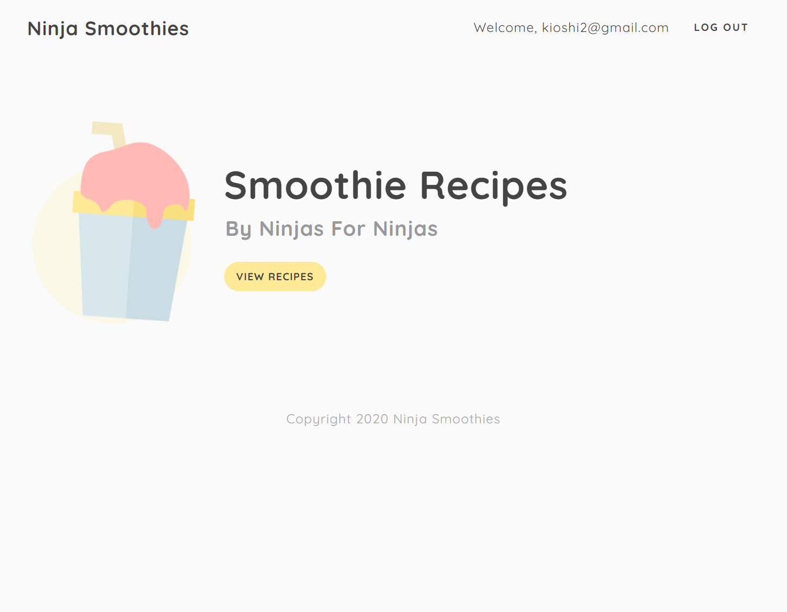

# Aplicacion Node.js JWT

Aplicacion de registro/ingreso con nodejs es6, view engine ejs, bcrypt, mongoose y express.



Para instalar aplicacion ejecutar:

```
npm install
```

Para iniciar aplicacion ejecutar

```
nodemon index
```

------

Referencia de proyecto:

[The net ninja](https://www.youtube.com/channel/UCW5YeuERMmlnqo4oq8vwUpg)